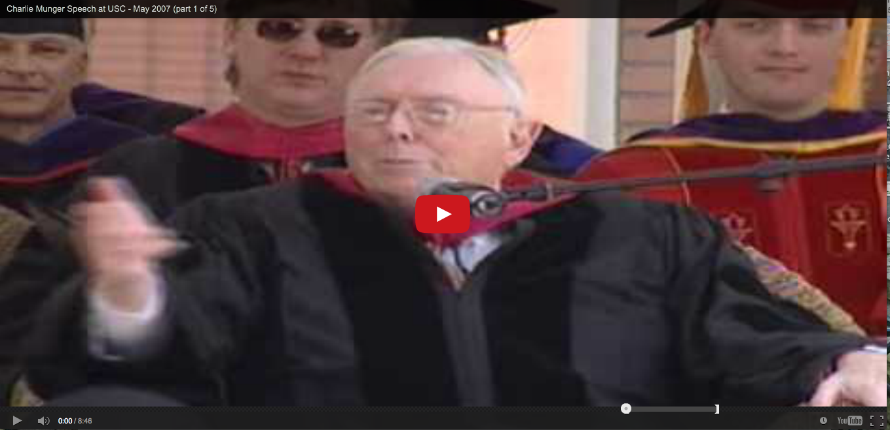

YouTube Deep Linking
===============

Deep linking within YouTube videos pertain linking to a specific start time or window within a video.  
It can be quite helpful.  Read more about [here](http://everydaylife.globalpost.com/create-start-end-point-youtube-35241.html) and [here](http://techcrunch.com/2008/10/25/youtube-enables-deep-linking-within-videos/).  This is helper script to streamline deep linking.

Click [here](http://www.youtube.com/v/L6Cy7UwsRPQ&start=373&end=428&version=3) for an example. 

